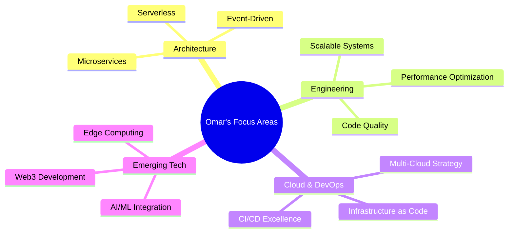

<!-- Animated Wave Header with Custom Background -->
<div align="center">
  
</div>

<!-- Animated Profile View Counter & Visitor Badge -->
<p align="center">
  
  <a href="https://wakatime.com/@bourraOmar"></a>
  
</p>

<!-- Animated Typing Text -->
<p align="center">
<a href="https://git.io/typing-svg"></a>
</p>

<!-- Dev Quote for Inspiration -->
<p align="center">
  
</p>

<!-- 3D Contribution Calendar Animation -->
<div align="center">
  
</div>

<!-- Custom Section Divider -->


##  About Me


```javascript
const bourraOmar = {
  location: "Tech Wonderland 🌍",
  occupation: "Digital Architect 🏗️",
  focus: ["Web Applications", "Cloud Native", "System Design"],
  codingStyle: "Clean, Efficient, Scalable",
  currentChallenge: "Mastering Distributed Systems",
  certifications: ["AWS Solutions Architect", "CKAD", "Azure DevOps"],
  lifePhilosophy: "Code for Humans, Optimize for Machines",
  funFact: "Can debug code and solve Rubik's cube simultaneously"
};
```

<p>
  I'm a passionate software engineer who thrives on creating elegant solutions to complex problems. My journey in technology has been driven by curiosity and a desire to build systems that make a meaningful impact. When I'm not coding, you'll find me exploring new technologies, contributing to open-source, or mentoring aspiring developers.
</p>

<!-- Custom Section Divider -->


##  Tech Ecosystem

<!-- Tech Icons with Hexagon Layout -->
<div align="center">
<table>
  <tr>
    <td valign="top" width="33%">
      <h3>Frontend Universe</h3>
      <div align="center">
        <a href="https://reactjs.org/" target="_blank"></a>
        <a href="https://www.typescriptlang.org/" target="_blank"></a>
        <a href="https://nextjs.org/" target="_blank"></a>
        <a href="https://www.tailwindcss.com/" target="_blank"></a>
        <a href="https://redux.js.org/" target="_blank"></a>
        <a href="https://vuejs.org/" target="_blank"></a>
      </div>
    </td>
    <td valign="top" width="33%">
      <h3>Backend Realm</h3>
      <div align="center">
        <a href="https://nodejs.org/" target="_blank"></a>
        <a href="https://expressjs.com/" target="_blank"></a>
        <a href="https://graphql.org/" target="_blank"></a>
        <a href="https://www.python.org/" target="_blank"></a>
        <a href="https://www.djangoproject.com/" target="_blank"></a>
        <a href="https://go.dev/" target="_blank"></a>
      </div>
    </td>
    <td valign="top" width="33%">
      <h3>DevOps Domain</h3>
      <div align="center">
        <a href="https://aws.amazon.com/" target="_blank"></a>
        <a href="https://kubernetes.io/" target="_blank"></a>
        <a href="https://www.docker.com/" target="_blank"></a>
        <a href="https://www.terraform.io/" target="_blank"></a>
        <a href="https://www.nginx.com/" target="_blank"></a>
        <a href="https://github.com/features/actions" target="_blank"></a>
      </div>
    </td>
  </tr>
  <tr>
    <td valign="top" width="33%">
      <h3>Data Universe</h3>
      <div align="center">
        <a href="https://www.mongodb.com/" target="_blank"></a>
        <a href="https://www.postgresql.org/" target="_blank"></a>
        <a href="https://redis.io/" target="_blank"></a>
        <a href="https://www.elastic.co/" target="_blank"></a>
        <a href="https://kafka.apache.org/" target="_blank"></a>
        <a href="https://www.prisma.io/" target="_blank"></a>
      </div>
    </td>
    <td valign="top" width="33%">
      <h3>Tools & Testing</h3>
      <div align="center">
        <a href="https://git-scm.com/" target="_blank"></a>
        <a href="https://www.figma.com/" target="_blank"></a>
        <a href="https://jestjs.io/" target="_blank"></a>
        <a href="https://www.cypress.io/" target="_blank"></a>
        <a href="https://www.postman.com/" target="_blank"></a>
        <a href="https://code.visualstudio.com/" target="_blank"></a>
      </div>
    </td>
    <td valign="top" width="33%">
      <h3>Emerging Tech</h3>
      <div align="center">
        <a href="https://www.tensorflow.org/" target="_blank"></a>
        <a href="https://webassembly.org/" target="_blank"></a>
        <a href="https://www.rust-lang.org/" target="_blank"></a>
        <a href="https://ethereum.org/" target="_blank"></a>
        <a href="https://www.serverless.com/" target="_blank"></a>
        <a href="https://flutter.dev/" target="_blank"></a>
      </div>
    </td>
  </tr>
</table>
</div>

<!-- Custom Section Divider -->


##  Analytics & Achievements

<div align="center">
  
</div>

<p align="center">
  <a href="https://github.com/anuraghazra/github-readme-stats">
    
  </a>
  <a href="https://github.com/anuraghazra/github-readme-stats">
    
  </a>
</p>

<p align="center">
  
</p>

<!-- Advanced GitHub Activity Graph with Custom Theme -->
<a href="https://github.com/ashutosh00710/github-readme-activity-graph">
  
</a>

<!-- Custom Section Divider -->


##  Highlighted Projects

<div align="center">
<p align="center">
  <a href="https://github.com/bourraOmar/project-stellar">
    
  </a>
  <a href="https://github.com/bourraOmar/system-nexus">
    
  </a>
</p>

<p align="center">
  <a href="https://github.com/bourraOmar/cloud-architect">
    
  </a>
  <a href="https://github.com/bourraOmar/ai-innovator">
    
  </a>
</p>
</div>

<!-- Custom Section Divider -->


##  Current Focus

<div align="center">
  
</div>



<!-- Custom Section Divider -->


##  Let's Connect

<div align="center">
<a href="https://bourraomar.dev" target="_blank">

</a>
<a href="https://linkedin.com/in/bourraomar" target="_blank">

</a>
<a href="https://twitter.com/bourraomar" target="_blank">

</a>
<a href="https://dev.to/bourraomar" target="_blank">

</a>
<a href="https://github.com/bourraOmar" target="_blank">

</a>
</div>

<!-- Custom Section for Email Contact -->
<div align="center">
  <a href="mailto:omar@bourraomar.dev">
    
  </a>
</div>

<!-- Final Words -->
<div align="center">
  <h3>💬 Let's collaborate and build something amazing together! 💬</h3>
</div>

<!-- Footer -->
<div align="center">
  
</div>
